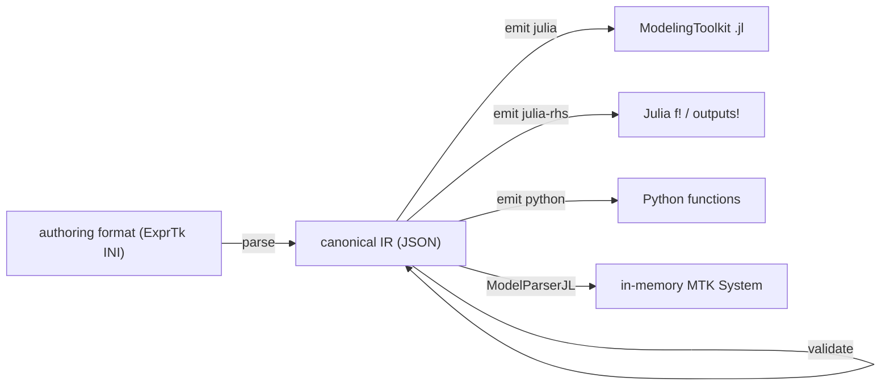

# model-parser

Converts process-model definitions into a canonical, backend-independent intermediate
representation (IR) and lowers it to generated model views. Today it parses the ExprTk-style INI
used by the MPC / simulation toolchain and emits a ModelingToolkit v11 Julia model, a plain Julia
ODE right-hand side and plain Python functions. It is the model-scaffold hub of the Advanced
Process Control toolbox; parameter identification, simulation and deployment are sibling tools
that consume the IR.

## Getting started

The PyPI package is `apc-model-parser`; the command is `model-parser`.

```sh
pipx install apc-model-parser        # or: uv tool install apc-model-parser
model-parser --help
```

From a checkout (uv):

```sh
uv sync --all-groups
uv run model-parser parse examples/models/model_monod_simple.ini -o monod.ir.json
uv run model-parser emit julia monod.ir.json -o monod.jl
uv run pytest                        # verify
```

## How it fits together



The IR is the single semantic contract: a new backend is one lowering module, not a mesh of
translators. The stored form of a model is the IR JSON plus the generated script, never a
serialized `System`.

## Documentation

- [DESIGN.md](DESIGN.md): architecture, boundaries and design decisions.
- [CHANGELOG.md](CHANGELOG.md): releases.
- [docs/cli.md](docs/cli.md): CLI commands and the contract of each generated view.
- [Documentation site](https://advanced-process-control.github.io/model-parser/): the same docs, rendered.
