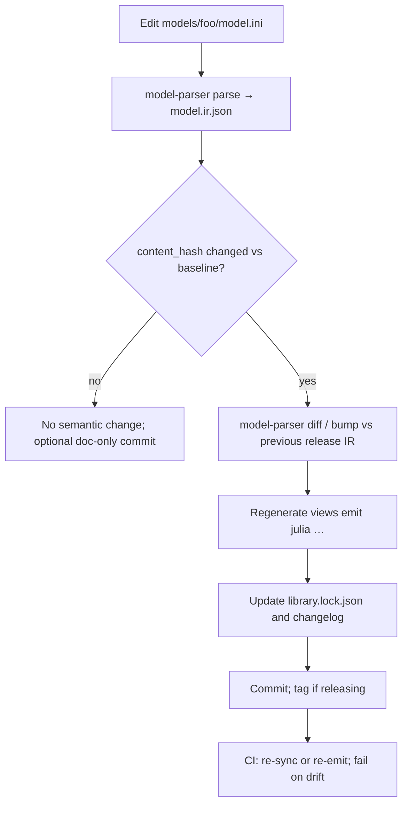

# Model library, content hashing, and semantic versioning

> How a **version-controlled model library** (for example the sibling repository
> [`Advanced-Process-Control/model-library`](https://github.com/Advanced-Process-Control/model-library))
> fits the ecosystem, how **`model-parser`** participates without becoming a
> registry or deployment tool, and how **hashes**, **SemVer**, and **git** play
> different roles.

## 1. Three axes of “version”

Do not collapse these into one number. They answer different questions.

| Axis | Question | Mechanism | Analogy |
|------|-----------|-----------|---------|
| **Content hash** | Are two scaffolds *semantically identical*? Did anything meaningful change? | `provenance.content_hash` in the IR (`sha256` over the semantic body, excluding `provenance`) | Content-addressed blob id |
| **Semantic model version** | Is this change backward-compatible for consumers of the scaffold API? | Human or tool-assigned SemVer (e.g. `model.source_version` plus release policy) | Library SemVer |
| **History / lineage** | Who changed what, when, and why? How do we review, branch, and roll back? | Git commits, tags, PRs | Git history |

The content hash is **identity and integrity**, not history. It supports deduplication, cache keys, cross-repository references (“this parameter set was fitted against scaffold `sha256:…`”), and CI checks that regenerated artifacts still match the IR. It does **not** replace git, and it is a poor user-facing release label.

See also [`ir-specification.md`](ir-specification.md) (identity / `content_hash`) and [`storing-mtk-models.md`](storing-mtk-models.md) (durable IR + generated `.jl`).

## 2. What the hash is good for

- **Drift detection** — Re-emit Julia (or future backends) in CI and assert outputs match expectations, or compare to a lockfile that records per-artifact digests.
- **Cache keys** — Compiled problems or other caches should key on `content_hash`, target profile, and relevant toolchain versions (see *Storing MTK models* §4).
- **Pins without paths** — Downstream contracts reference the scaffold by hash, not by repository path (“hashes over file paths” org vocabulary).
- **Equivalence** — Two authoring files that normalize to the same IR yield the same hash (useful for detecting accidental duplicates or proving a refactor was semantics-preserving).

## 3. Semantic diff and inferred bumps

Because expressions live in an **explicit tagged tree** in the IR (not strings; see [ADR 0003](../decisions/0003-explicit-expression-ir.md)), the tool can compare two IRs structurally and suggest a **SemVer bump** for the *model* (distinct from `ir_version`, which versions the IR schema).

The CLI exposes:

```text
model-parser diff  <old.ir.json> <new.ir.json> [--json]
model-parser bump  <old.ir.json> <new.ir.json> [--json]
```

`diff` lists human-readable changes. `bump` prints a suggested bump level:

| Level | Typical meaning (conservative policy) |
|-------|----------------------------------------|
| `none` | Semantic bodies are identical (`content_hash` match). |
| `patch` | Documentation-like or bootstrap tweaks only: e.g. `ModelInfo` description / `source_version` / `metadata`, variable `unit` / `description` / `roles`, `profiles`, or **only** numeric **defaults** on existing parameters (same names, same order). |
| `minor` | **Additive** scaffold API: new parameters **appended** after all previous parameters, with unchanged names and defaults for all previous parameters, and no change to states, inputs, outputs, locals, or equations. |
| `major` | Anything else: renamed model, changed state/input/output set, changed equations, changed local expressions, removed or reordered parameters, `ir_version` or `independent_variable` change, or any change not covered by `patch` / `minor`. |

Policies can evolve; treat `bump` as **advisory** until your library documents stricter rules. When in doubt, the implementation prefers **major** over false compatibility.

## 4. Where logic lives: parser vs library repository

**Inside `model-parser` (IR contract, pure logic):**

- `parse` / `emit` / `validate` / hashing / JSON Schema.
- **`diff` and `bump`** — semantic comparison and bump *suggestion* (no git, no catalog).

**Inside `model-library` (orchestration, I/O):**

- Directory layout, **lockfile** / catalog, CI that regenerates artifacts and fails on drift.
- Git tags, release notes, and human curation.

This keeps `model-parser` small and standalone (see [`model-parser.md`](model-parser.md) §2 and *Non-goals*) while still enabling a “living” multi-representation library.

## 5. Suggested `model-library` layout

One directory per model; **one authoring file** is the human edit surface; IR and lowered views are **generated** and committed (or generated only in CI — your choice; the sibling repo defaults to committed artifacts for reviewability).

```text
models/<name>/
  model.ini              # authoring (ExprTk INI today)
  model.ir.json          # canonical IR (generated by model-parser parse)
  views/
    model.jl             # generated by model-parser emit julia
library.lock.json        # index: names, paths, content_hash, optional view hashes
```

A thin driver (`scripts/sync.sh`, `just`, or Makefile) invokes the installed `model-parser`. CI runs the same pipeline with `--strict` checks (e.g. `git diff --exit-code` after sync).

## 6. End-to-end workflow



Do **not** hand-edit generated `.jl` files; they are compilation products (see [`storing-mtk-models.md`](storing-mtk-models.md)). Planned `emit ini` round-trip (product roadmap) will reduce the need to maintain two authoring encodings by hand.

## 7. Scaffold vs parameter sets vs scenarios (authoring files)

The IR intentionally describes the **scaffold** only: structure, equations, roles, units, parameter **declarations** (optional defaults for bootstrap). **Parameter sets** and **scenarios** are **sibling contracts** (fitted values, `x0`/`u0`, horizons) — not stored in the canonical IR as execution truth.

### Current ExprTk INI

Today’s frontend documents that **`[x0]` / `[u0]` are dropped** with a warning because they are scenario data ([`model-parser.md`](model-parser.md) §4). **`[Dimensions]`** is still required: it declares how many `x*`, `u*`, and `y*` slots exist before equations are parsed. In principle, counts could be **inferred** from the maximum indices appearing in `dx*`, `y*`, and `u*` references; that would be a **frontend enhancement**, not an IR change.

### Should parameter *values* leave the INI?

**Ideal split (org contracts):**

- **Scaffold** — declares parameters (names, units, bounds later); optional defaults only for convenience / tests.
- **Parameter set** — JSON (or similar) referencing the scaffold by **`content_hash`**, carrying the numeric values used for calibration or deployment.
- **Scenario** — references scaffold (and optionally a parameter set), carries `x0`, `u0`, horizon, etc.

Whether values also appear in the INI is a **workflow choice**:

- Keeping numeric defaults in INI is convenient for quick `parse → emit` demos and matches legacy MPC files.
- Moving values entirely into parameter sets is cleaner for **governance** (one hash-pinned scaffold, many value sets) and avoids duplicating “truth” in two places.

`model-parser` does not yet ship a parameter-set file format; when the org standardizes one, the library should adopt it alongside the IR.

### Optimal authoring format (if not tied to INI)

A greenfield layout often works well as **two or three small files per model** (or one folder):

1. **`scaffold.*`** — YAML or TOML: metadata, symbol tables, equations as structured expressions *or* as controlled strings parsed by the same expression grammar. YAML maps naturally to nested expression trees for tooling.
2. **`parameters.default.json`** — optional; references `content_hash` of the IR once emitted, or references `model.name` + lockfile version for humans.
3. **`scenario.*`** — initial conditions, setpoints, simulation horizon.

The important part is not the concrete syntax but the **separation of concerns** and a single **semantic hub** (the IR) so backends stay renderers, not re-parsers.

## 8. Reproducible provenance timestamps

For committed IR JSON, `provenance.created_at` would otherwise change on every regeneration. When **`SOURCE_DATE_EPOCH`** is set (Unix epoch seconds, per [reproducible-builds.org](https://reproducible-builds.org/docs/source-date-epoch/)), the INI frontend uses it for `created_at` instead of the wall clock. Library sync scripts can export this variable so IR files stay byte-stable when semantics are unchanged.

## 9. Larger roadmap (optional)

- **Library lockfile** — pins each model’s `content_hash` and digests of generated views; CI verifies them.
- **`emit ini` round-trip** — product roadmap item; reduces manual dual maintenance of INI and other views.
- **`ir_version` migrations** — when the IR schema bumps, migration tooling plus ADRs ([`ir-specification.md`](ir-specification.md) §5).
- **Composite models** — dependency graph of scaffolds; composite content hash derived from constituents (Merkle-style).
- **Signing / extended provenance** — optional fields for signer identity, git commit SHA, parent scaffold hash (policy and ADR when needed).

## 10. Related documents

- [`model-parser.md`](model-parser.md) — product scope and CLI overview.
- [`ir-specification.md`](ir-specification.md) — IR shape and `content_hash` definition.
- [`storing-mtk-models.md`](storing-mtk-models.md) — IR + generated `.jl` as durable artifacts.
- [`language-strategy.md`](language-strategy.md) — Python/Julia split at the IR file boundary.
